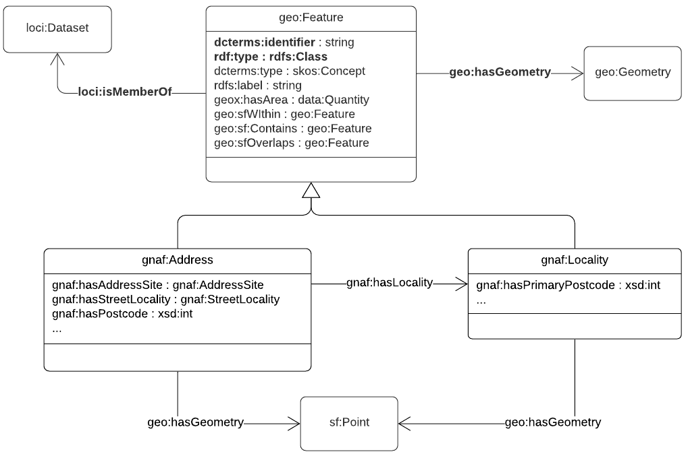
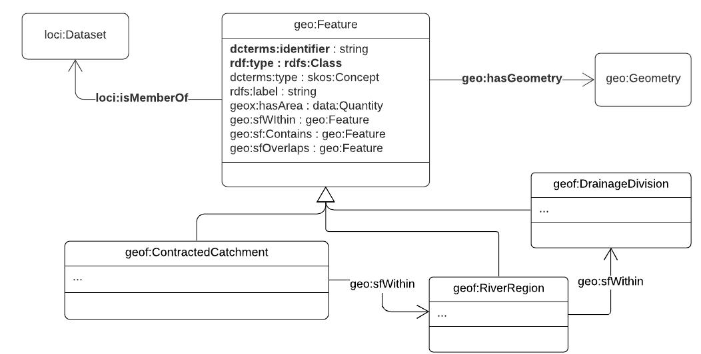

# Loc-I application schemas

The initial Loc-I datasets come from three very different custodians: 
1. [Australian Statistical Geography Standard](https://www.abs.gov.au/websitedbs/D3310114.nsf/home/Australian+Statistical+Geography+Standard+(ASGS)) from the [Australian Bureau of Statistics](https://abs.gov.au) 
2. [G-NAF](https://psma.com.au/product/gnaf/) from [PSMA](https://psma.com.au/)
3. [GeoFabric](http://www.bom.gov.au/water/geofabric/) from [Bureau of Meteorology](http://www.bom.gov.au/)

RDF/OWL ontologies (application schemas) for these data were originally developed by different teams spread over an extended period. 
They followed a variety of design patterns, and were highly uneven in their level of detail and the way in which they re-use standard elements from existing RDF vocabularies. 
In particular, some ontology designers are comfortable borrowing from existing RDF vocabularies, while others prefer to define most things fresh, and then map to other RDF vocabularies later, or never. 
This is partly just a stylistic preference, but it also reflects varying levels of trust for RDF vocabularies not under local control. 

However, a certain level of consistency is required if we want Loc-I to include many datasets from multiple sources. 
[Rules for Loc-I datasets](./loci-datasets.md) defines a minimal content model for Loc-I conformant data, using elements from standard OWL ontologies and RDF vocabularies to support common query patterns. 
The ontologies (application schemas) for the initial Loc-I datasets have now been revised to conform to these Loc-I rules. 

The revised ontologies for the Loc-I datasets used in the **linked-data services** extend the [core Loc-I feature ontology](./loci-datasets.md) with additional classes, properties, and controlled vocabularies (usually expressed using SKOS):

## ASGS Ontology

[Ontology files and full documentation](https://github.com/AGLDWG/asgs-ont)

_Figure 1 - ASGS Meshblock (partial model)_

## G-NAF Ontology

[Ontology files and full documentation](https://github.com/AGLDWG/gnaf-ont) 

_Figure 2 - GNAF (partial model)_

## Geofabric Ontology

[Ontology files and full documentation](http://linked.data.gov.au/def/geofabric)

_Figure 3 - Geofabric (partial model)_

## Conversion of data 

Conversion of the original data from the cache to the preferred pattern is illustrated by the examples below: 
* [original form](https://raw.githubusercontent.com/CSIRO-enviro-informatics/loci-testdata/simplify-1/loci-ld-dataset/loci-instances-0.ttl)
* [simplified/harmonized form](https://raw.githubusercontent.com/CSIRO-enviro-informatics/loci-testdata/simplify-1/loci-ld-dataset/loci-instances-1.ttl)

## Examples
Details by product: 

* [ASGS](https://github.com/CSIRO-enviro-informatics/asgs-dataset/issues/13)
* [G-NAF](https://github.com/CSIRO-enviro-informatics/gnaf-dataset/issues/11)
* [Geofabric](https://github.com/CSIRO-enviro-informatics/geofabric-dataset/issues/26)
