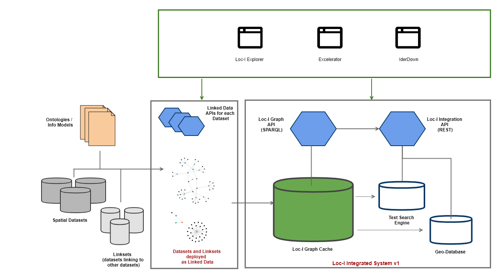
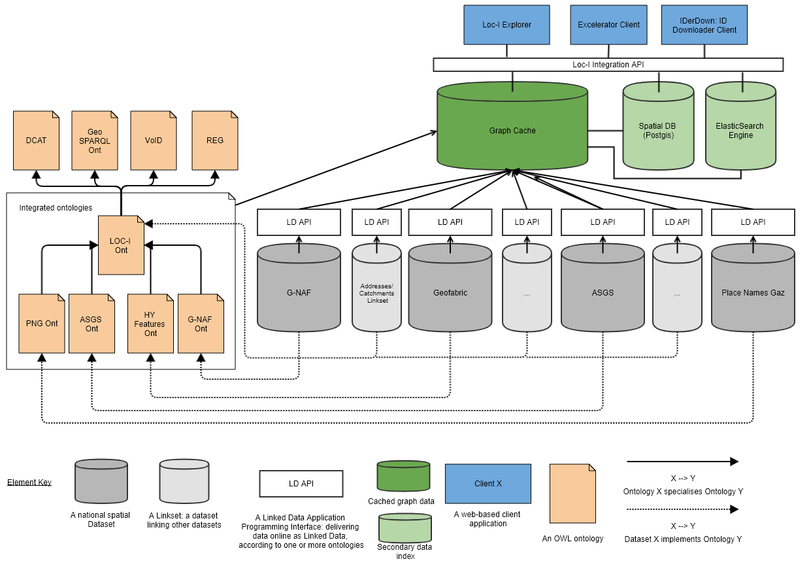

# Loc-I Reference Cache

## What

Central cache holding a set of spatial layers to serve as a reference for other applications. The layers included are as directed by the Loc-I steering committee.     

## Why

The Loc-I reference cache provides a graph store for applications and users to query spatial linked data features. This provides users with SPARQL APIs that allows for flexible and powerful queries across the graph store (triple store).
     
## How 

Via a graph store (RDF triple store). The current implementation uses GraphDB.

## Simplified architecture view 

### Detailed architecture view 

## MVP 

GraphDB store that caches ASGS 2016, Geofabric v2.1.1, G-NAF (as of May 2016).
### Querying the graph cache API

The MVP applications that are being developed, query APIs (either via Loc-I integration API or directly via SPARQL to the graph triple store) using SPARQL queries. Using path-based SPARQL queries, it is possible to ask multi-hop questions leveraging the unique power of graph-based DBs like:

* Which StatisiticalAreaLevel2 feature is this Address point within?
* How many addresses are within this StatisticalAreaLevel4?
* How many Meshblocks are within this catchment?
* How many addresses are there in the overlapping intersectional area between this Meshblock and this Catchment?
* How many Meshblocks are within this DrainageDivision

Running queries like that allows client applications to easily perform tasks like:
* Cross-Dataset topological-relationship based aggregation and disaggregation of values
* Cross-Dataset Area-based aggregation and disaggregation (reapportionment)
* Filtering feature lists by Cross-Dataset relationships.

## Anticipated future functionality

* Added datasets (ASGS 2011, G-NAF 2019, QLD Cadastre) - see the [data](/data) page for a list of data current and future.

