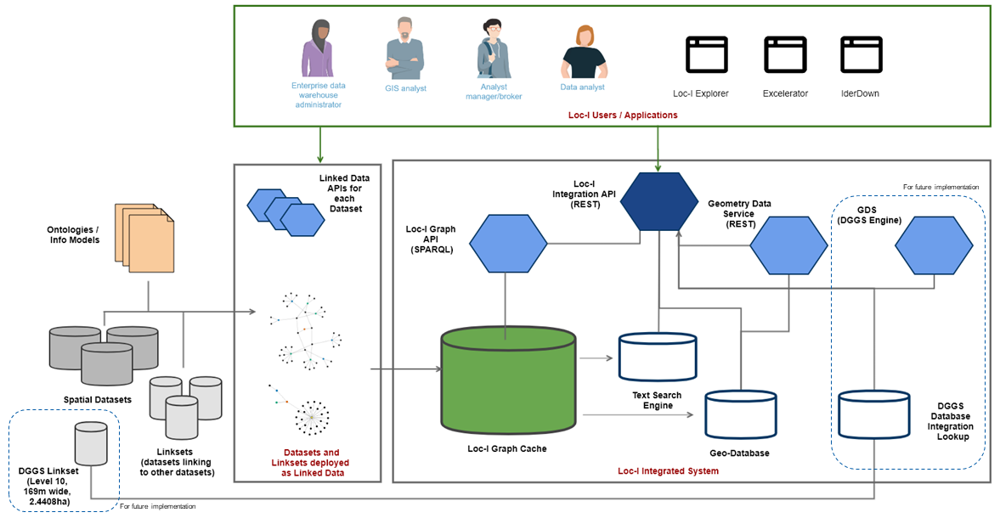
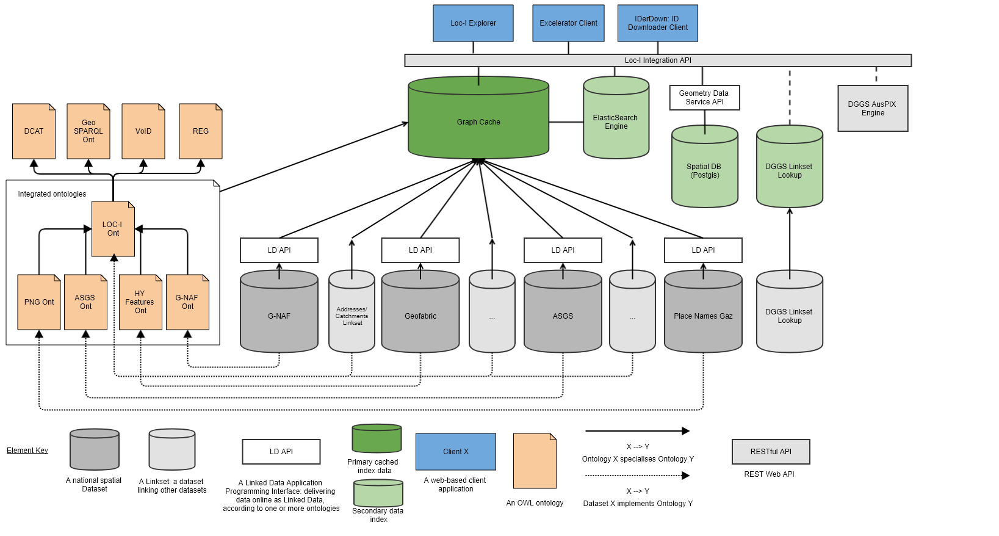

## Loc-I Reference Integrated Spatial Knowledge Graph 

The Loc-I project is exploring tools and infrastructure for enabling improved analysis and decision making capability that integrates data across multiple geographies. Loc-I is exploring the use of semantics of the geographies in a consistent manner using ontologies, including their topology, semantic hierarchies and other relationships. These semantics are deployed as Linked Data on the web, so that each geography and its features are able to be identified precisely, unambiguously, with rich descriptions and semantics, via multiple views that are both human- and machine-readable, and available in multiple formats. 

The Loc-I project is providing a reference spatial knowledge graph, called the [Loc-I reference cache](ref-cache.md), that aggregates and indexes all relevant Linked Data resources. This enables a Hybrid Spatial Knowledge Graph (refer to the figure below) for querying for Loc-I resources through a graph query engine (SPARQL), and REST APIs for full-text search and spatial searches. 

In particular, these provide users the ability to:
* Understand a location resource, alternate identifiers, and its semantic relationships
* Lookup spatial identifiers by text label or location (e.g. lat-lon coordinate)
* Query geometric topological relationships of a given location, e.g. show me all locations in a geography (or multiple geographies) that are contained within a given location. 

## Detailed architecture view 

